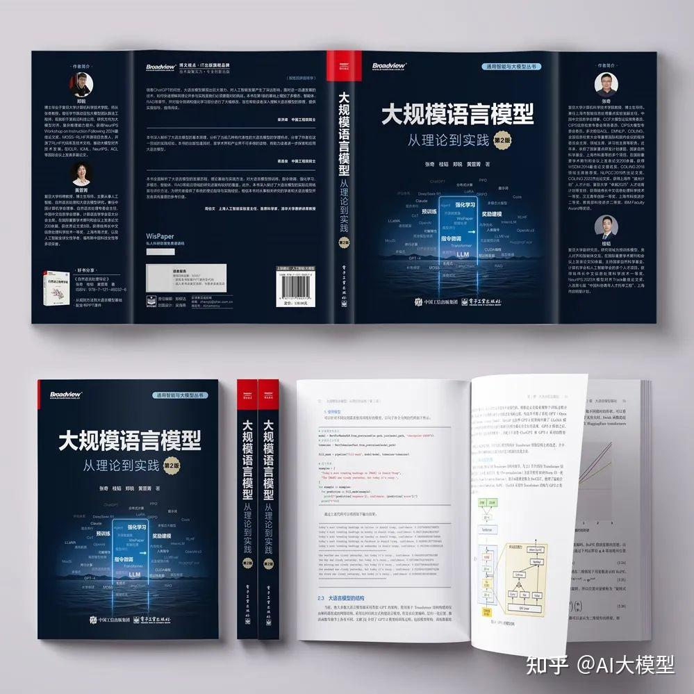
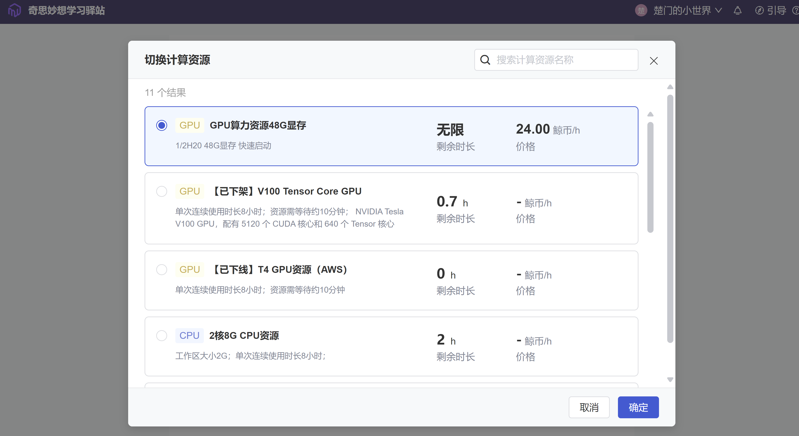

# 学习《大语言模型：从理论到实践》的复现与思考

## 1\. 项目简介

本仓库是我于2025年暑假期间对《大语言模型：从理论到实践》一书进行系统性学习、代码复现与深度思考的完整记录。

### 1.1 学习目标

本次学习的核心目标并非简单地运行全部代码，而是：

1.  **构建体系化认知**：深入理解大语言模型从底层原理到前沿应用的全链路技术。
2.  **深化理论与实践的结合**：通过“跑通-读懂-思考-总结”四步法，将书本理论与配套代码进行交叉验证，掌握核心算法的实现细节。
3.  **培养批判性与创新性思维**：针对每个技术点，结合AIGC工具进行追问与探讨，形成自己独特的学术见解，为未来的博士研究寻找方向。
4.  **沉淀可复用的知识库**：将学习过程中的笔记、代码注释、实验结果和深度思考整理归档，方便随时回顾与查阅。

### 1.2 学习方法

我将采用为期18天的学习计划，结合实体书与[官方代码库](https://github.com/intro-llm/intro-llm-code)，分阶段、有侧重地进行学习。对于算力要求高的章节（如分布式训练）或是偏向于应用目前我还无需多关心的章节（如大模型的开发和应用），将以理论学习和代码研读为主；对于核心且可实践的章节（如强化学习、指令微调、RAG），将进行完整的代码复现与分析。

## 2\. 学习计划与进度

本仓库将根据以下18天学习计划，逐日更新学习笔记与成果。该计划优先保障对LLM核心理论的深入理解。

| **阶段** | **天数** | **核心章节** | **学习重点与产出** |
| :--- | :--- | :--- | :--- |
| **一、理论基石** | 5天 (Day 1-5) | Ch2: 大语言模型基础 Ch3: 预训练数据 | **目标**：精通Transformer架构与数据处理哲学。 **产出**：对Transformer原理、BERT预训练流程、数据清洗与去重策略的深度分析笔记。 |
| **二、核心训练范式** | 7天 (Day 6-12) | Ch5: 指令微调 Ch6: 强化学习 | **目标**：掌握当前主流的模型能力引导与对齐技术。 **产出**：对SFT、LoRA等PEFT方法及RLHF三阶段流程的代码复现与原理剖析。 |
| **三、性能与评估** | 3天 (Day 13-15) | Ch10: 效率优化 Ch11: 模型评估 | **目标**：理解模型效率和评估方法论。 **产出**：对vLLM等推理优化框架及LLM评估方法的概念性理解和关键代码分析。 |
| **四、前沿应用探索** | 3天 (Day 16-18) | Ch7: 多模态 Ch8: 智能体 Ch9: RAG | **目标**：了解LLM能力的延伸方向。 **产出**：对多模态、Agent、RAG等热门应用领域的关键技术和实现模式进行综述性学习。 |

## 3\. 仓库内容结构

本仓库将以章节为单位进行组织，每个章节文件夹下包含：

  - `README.md`: 该章节的学习笔记，包含：
      - **问题与回答**：结合AIGC工具和网课进行的深度追问与思辨过程记录。
      - **思考**：在学习后的一些念头和心得体会
  - `code/`和`code/README.md`: 对原代码的复现、修改或补充实验，可用于查看实验结果，以及复现实验的一些收获和心得
  - `py_tools/`: 我新加的一些python工具脚本，方便对源代码操作

## 4\. 如何查看本项目

1.  **从README开始**：建议首先阅读本README，了解我的学习全貌。
2.  **分章节浏览**：进入`Ch X`（章节序号）目录，选择你感兴趣的章节进行查阅。
3.  **关注“问题”**：每个章节的笔记是我学习深度的体现，欢迎交流与探讨。

## 5\. 特别鸣谢——HeyWhale-和鲸社区

感谢heywhale的**奇思妙想学习驿站**，在匆忙将V100下架以后又匆忙上架了H20，为了徒方便，又将H20设为了无限的使用时长。最后为本次实验提供了半张H20的可靠高端算力资源，这才是暑期实习的最大收获。

## *期待这次系统性的学习能为我即将开始的博士生涯奠定坚实的基础。*